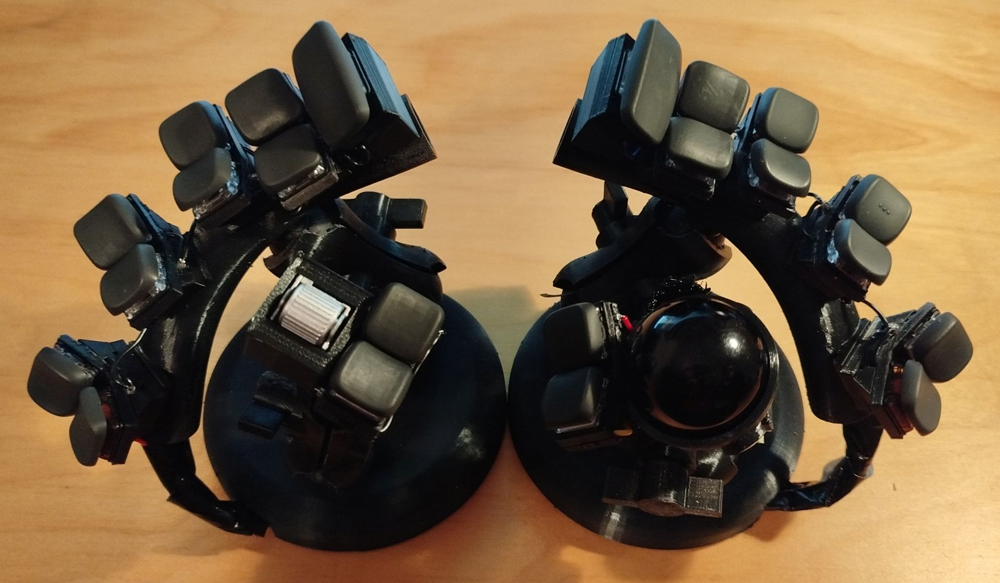

# CC22

**An extrem ergonomic keyboard with integrated trackball and roller encoder**

# Quick links

- [build case](doc/build-case.md)
- [wiring](doc/wiring.md)
- [build key caps](doc/build-key-caps.md)
- [firmware](doc/firmware.md)

# Features

- min. necessary finger movement
- using QWERTY (in my case QWERTZ, cause I'm using a german layout)
- max. ergonomic
- only 22 keys
- integrated trackball + roller encoder
- hot-swapable
- easy to adjust
- diodeless
- using Raspberry Pico
- handwired

## using chords for 3rd row

The finger movement should reduced as much as possible.
Every finger was assigned two keys.
Pressing both keys simulates a middle row => a QWERTZ layout is possible.

The Index finger gets 3 physical keys, which can simulate 6 virtual keys.

With the terrific KLP keycaps it is much easier to press both keys blind.

# BOM (Bill of Material)

- 2 raspberry pi Pico (I'm using the Pico 2W, but the Pico 1 should also work)
- 1 PMW3389 trackball sensor
- 3 trackball bearings (s. https://kbd.news/Trackball-bearing-comparison-1757.html, I'm using BTUs of steel)
- 1 EVQWGD001 roller sensor (no longer available, so https://github.com/Taro-Hayashi/THQWGD001 could be a replacement perhaps)
- 2 100mm metal disc (2mm thickness - or more) for the feet
- 22 kailh hot swap sockets
- 22 kailh Choc V1 keys
- lots of 2mm flat hat screws
- lots of 2.5mm flat hat screws
- lots of 3mm 
- lots of heat inserter sets
- lots of cables (I'm using AWG 26 with solid core, but this is a matter of personal preference)

# Why yet another keyboard?

I'm using a piantor keyboard since over a year and I'm quite happy with it.
The main issue is the lack of a track ball, so I switch beetween keyboard and mouse permantly.
A 2nd disadvantage are the thumb-clusters, which are not very ergonomic.

I'm print the case of a charibdis keyboard, but the distances between the keys are too far for me.

# Related keyboards

- Charybdis (a famous keyboard with trackball)
- Dactyl Manuform Skeleton (has a similar exotic design)
- Gull + Heron from Sneftel
- Proto2 + Heavily Modified Gigi (using chords for 3rd row too)

# Licence

- case: CC-BY-SA
- keycaps: CC-BY-SA
- firmware: GPL V3

# install venv

- pip install build123d
- pip install ocp_vscode
- pip install shapely